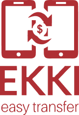
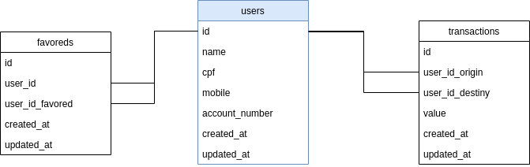

# Sobre este projeto

Bem vindo(a) ao aplicativo **Ekki - Easy Transfer**, uma MVP facilita a transferência de valores entre os usuários do Grande Banco Islandês.

  

## Propósito deste projeto

Além de um aperfeiçoamento pessoal no uso das tecnologias implementadas, este projeto foi idealizado pela **4all** para um processo de seleção ao cargo de desenvolvedor _fullstack_ de Node.js e ReactJS.

Se você está curioso sobre como ficou a aplicação, <a href="http://167.71.177.44" target="_blank">clique aqui</a> para acessá-lo. **Mas não esqueça de ler o restante deste README** para saber como foi o processo de desenvolvimento e todas as _techs_ utilizadas 😊!

## Processo de desenvolvimento

Gostaria de expor, numa forma superficial para não tomar muito tempo, todo o processo de desenvolvimento desta aplicação.

### Modelando os dados

Primeiramente iniciei um simples diagrama DER que, por mais simples que seja o projeto, sempre é importante ter uma visão da disposição dos dados da aplicação. Isso porque este projeto pode ser mantida por um outro desenvolvedor ou até mesmo para a lembrança do proṕrio criador da aplicação.

Selecionei o SGBD **PostgreSQL** rodando dentro de um container do **Docker**.

### Design

Utilizando o **Figma**, fiz o layout das páginas do projeto. Você poderá <a href="https://www.figma.com/file/gnyR14MsiygWP2kZJPbOvI/Ekki?node-id=0%3A1" target="_blank">ver aqui</a>.

Para seleção das cores fiz uso da ferramenta de pigmentação da **Shapefactory**, selecionando esta paleta e suas variações: <a href="https://pigment.shapefactory.co/?s=2&a=513026&b=c23949" target="_blank">Saddle & Brick Red Dark Shade 01</a>.

O desenvolvimento do logotipo da MVP foi feito utilizando o **Canva**, que você poderá visualizar <a href="https://www.canva.com/design/DADmiWGscH4/lVPKPhhTA68Z08j4f-2KPw/view?utm_content=DADmiWGscH4&utm_campaign=designshare&utm_medium=link&utm_source=sharebutton" target="_blank">aqui</a>.

### Ambiente de desenvolvimento

Utilizei o **Visual Studio Code** para a codificação do projeto, configurando o **ESlint** para aplicação do padrão de desenvolvimento da **AirBNB**.

#### Backend

Utilizei **Express Framework** para criar o servidor web como o backend da aplicação. Abaixo elenco os recursos utilizados no desenvolvimento:

- **Sequelize** como ORM;
- **dotEnv** para fazer uso das variáveis de ambiente;
- **JsonWebToken** para geração das tokens de acesso via JWT;
- **Yup** para validação dos dados de entrada das requisições.

#### Frontend

O cliente poderá contar com uma aplicação feita em ReactJS consumindo via requisições HTTP o backend desenvolvido. Abaixo elenco os recursos utilizados:

- **Axios** como serviço de requisição HTTP à API;
- **@rocketseat/unform** para manipulação de dados de formulário;
- **Yup** para validação dos dados do formulário;
- **Immer** para trabalhar de uma forma mais conveniente com os estados imutáveis do React;
- **Styled components** para estilização utilizando a fiel sintaxe CSS sobre a aplicação ReactJS;
- **Polished** como forma mais simples e rápida de aplicação de diferentes tonalidades no uso das cores;
- **Redux e Sagas** para compartilhamento de informações entre os componentes;
- **Redux Persist** para armazenar variáveis de estados no _local storage_ do navegador;
- **Reactotron** para facilitar o DEBUG, principalmente quando faz-se o uso do Redux;

#### Versionamento

Utilizei o **GitHub** para versionar a aplicação back e frontend num monorepo.

### Ambiente de produção

Para testar a aplicação, mandei para o meu _droplet_ da **Digital Ocean**, criando ali um container Docker para o banco de dados e deixar rodando a API do Ekki. O frontend está no mesmo _droplet_ com um NGINX configurado para rodar em http://167.71.177.44/.

> _Como estou com um pequeno problema com o meu domínio junto ao GoDaddy, gostaria de ter entregue este teste utilizando o protocolo SSL 😓._
